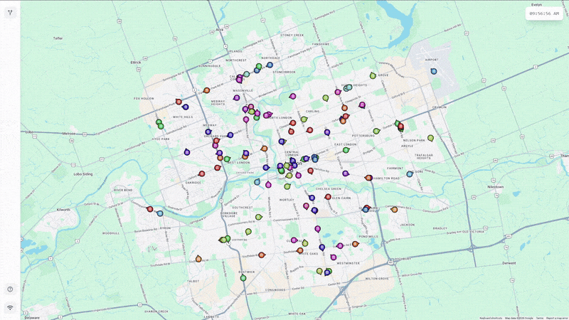

# RouteRadar

**Live demo: [transit.aidenpaleczny.com](https://transit.aidenpaleczny.com/)**

RouteRadar is a real-time transit tracking application designed around publicly accessable raw transit data from the London Transit Commission (LTC). It visualizes live bus locations in London, Ontario on an interactive Google Map, providing users with up-to-the-minute updates on vehicle positions, routes, and arrival times.

This project demonstrates the integration of real-time data feeds (GTFS-Realtime) with a modern web stack, utilizing GraphQL Subscriptions for efficient, low-latency updates.



*GIF compressed for GitHub -- check out the [live demo](https://transit.aidenpaleczny.com/) to see it more clearly!*

## Features

- **Real-Time Tracking:** Watch buses move live on the map as they report their positions.
- **Live Updates:** Uses GraphQL Subscriptions over WebSockets to push updates instantly to the client without manual refreshing.
- **Route Selection:** Filter the map to show specific bus routes of interest.
- **Stop Predictions:** View estimated arrival times for stops along a route.
- **Vehicle Details:** Access detailed information such as vehicle occupancy, bearing, and destination.
- **Responsive Design:** Optimized for both desktop and mobile viewing.

## Tech Stack

### Client
- **Framework:** [React](https://react.dev/) (bootstrapped with [Vite](https://vitejs.dev/))
- **Styling:** [Tailwind CSS](https://tailwindcss.com/)
- **State Management & Data Fetching:** [Apollo Client](https://www.apollographql.com/docs/react/)
- **Maps:** [Google Maps JavaScript API](https://developers.google.com/maps/documentation/javascript)
- **Routing:** [React Router](https://reactrouter.com/)

### Server
- **Runtime:** [Node.js](https://nodejs.org/)
- **Server Framework:** [Express](https://expressjs.com/)
- **API:** [GraphQL](https://graphql.org/) with `graphql-ws` for WebSocket subscriptions.
- **Data Source:** Polling service that fetches GTFS-Realtime data (Vehicle Positions & Trip Updates) from the LTC API.

## Getting Started

### Prerequisites
- Node.js (v18 or higher recommended)
- npm (Node Package Manager)
- A Google Maps API Key

### Installation

Clone the repository:
```bash
git clone https://github.com/apalecz2/RouteRadar.git
cd RouteRadar
```

#### 1. Backend Setup

Navigate to the server directory:
```bash
cd server
```

Install dependencies:
```bash
npm install
```

Start the server:
```bash
npm start
```
The server will start on `http://localhost:4000` (or the port defined in `src/config.js`). It exposes GraphQL Subscriptions over a WebSocket connection at `/graphql`.

#### 2. Frontend Setup

Navigate to the client directory:
```bash
cd ../client
```

Install dependencies:
```bash
npm install
```

Create a `.env` file in the `client` directory.

Example `.env` for local development:
```env
VITE_BACKEND_URL=http://localhost:4000
VITE_BACKEND_WS_URL=ws://localhost:4000/graphql

VITE_GOOGLE_MAPS_API_KEY=your-key-here
VITE_MAP_ID=map-key-here
```

Start the development server:
```bash
npm run dev
```
Open your browser and navigate to the URL shown in the terminal (usually `http://localhost:5173`).

## Architecture

The system consists of two main components:

1.  **Polling Server:** The backend repeatedly triggers the LTC GTFS-Realtime endpoints (`Vehicle/VehiclePositions.pb` and `TripUpdate/TripUpdates.pb`). It processes this data, mapping trip updates to vehicles, and caches the latest state.
2.  **GraphQL Subscription Server:** When the frontend subscribes to updates (e.g., for a specific route), the server pushes the latest cached data to the client via WebSockets whenever new data is polled.

### Outbound bandwidth

Render bills *service-initiated* traffic, so the response body of every feed the poller downloads counts against the hosting plan's outbound allowance. The always-on poller is by far the largest consumer, and two things keep it affordable:

- **Protobuf, not JSON.** LTC publishes each realtime feed both as native GTFS-Realtime protobuf (`.pb`) and as a much more verbose JSON rendering of identical data. `TripUpdates` measured 22.5 MB as JSON versus 2.9 MB as protobuf (`VehiclePositions`: 95.9 KB versus 14.3 KB), so the server consumes the protobuf and decodes it with `gtfs-realtime-bindings`.
- **Polling only while someone is watching.** The service is kept awake around the clock by `/keepalive`, so an ungated poller would download both feeds every 30s forever, whether or not anyone had the site open. `server/src/services/activityService.js` counts open GraphQL subscriptions; the loop parks when that count hits zero and resumes on the next subscriber.

One consequence worth knowing when reading the polling code: because the poller idles, the cached state a newly connected client is seeded with may be as old as the idle period. The first live poll follows within a second or two, and the client already discards vehicle updates older than 90s.

Route/stop geometry (`client/public/stops.json` and `routes.json`) comes from a separate source: LTC's *static* GTFS feed (schedule/shape data, as opposed to the realtime feeds above), which changes only a few times a year at seasonal service updates. Rather than fetch and process that on the always-on realtime server, [`scripts/gtfs-static/`](scripts/gtfs-static/) is a standalone transform (unit-tested against a fixture feed — see `transform.test.mjs`) run weekly by [`.github/workflows/update-gtfs.yml`](.github/workflows/update-gtfs.yml), which downloads the feed, regenerates both JSON files, and commits them only if the feed actually changed. A push to `main` triggers Render's normal static-site rebuild — no extra runtime infrastructure needed for this.

## Scaling

The backend is intentionally a single Node.js process: one polling loop fetches LTC's GTFS-Realtime feeds, caches the latest state in-memory (`server/src/state.js`), and fans updates out to subscribed clients via a Node `EventEmitter` feeding GraphQL subscriptions over WebSockets.

This is deliberate, since fan-out to subscribers is O(subscribers) against an in-memory queue, so a single instance comfortably handles far more concurrent WebSocket clients than this project sees in practice. In-memory state is also the right call here: the data is inherently ephemeral (live vehicle positions), so there's nothing to persist -- a restart just repopulates from the next poll cycle (~30s).

Note that where this design would break down is horizontal scaling -- running multiple server instances behind a load balancer for redundancy or throughput. As-is, each instance would poll LTC independently (wasteful, and risks rate-limiting), and a client connected to instance A would never see events polled by instance B, since both the poller and the pub/sub are process-local. Solving that would mean:

- Decoupling the poller into its own single worker process, so LTC is only ever polled once.
- Replacing the in-process `EventEmitter` with a shared pub/sub layer (e.g. Redis Pub/Sub) that all API instances subscribe to, so any instance can serve any client regardless of which one is "connected" to a given WebSocket.

Redis (or similar) solves that problem specifically. It's not a general performance upgrade, and adding it without the multi-instance requirement would just be an unused dependency. It isn't used here because the current single-instance design already meets the project's actual load.

## Deployment

The project is deployed on [Render](https://render.com/). `render.yaml` configures the static frontend build; the backend WebSocket server is deployed as a separate Render web service.

## License

MIT — see [LICENSE.md](./LICENSE.md).

## Author

Built by [Aiden Paleczny](https://github.com/apalecz2).
